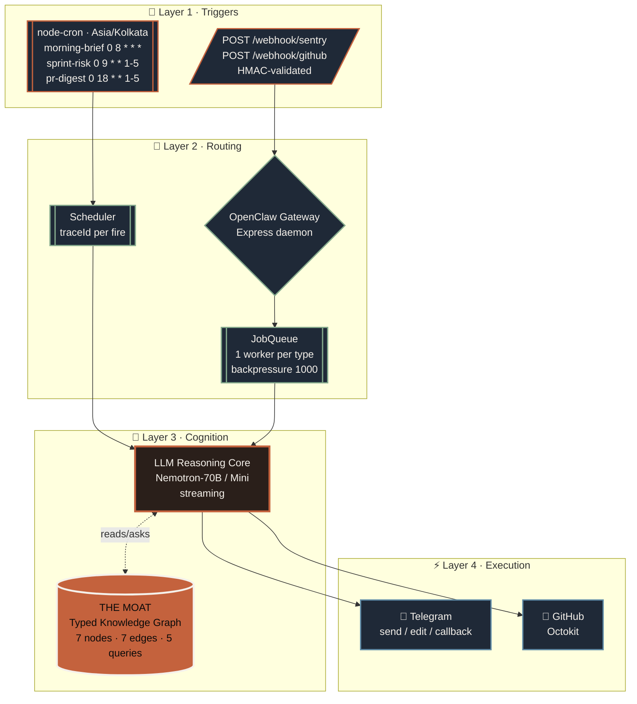
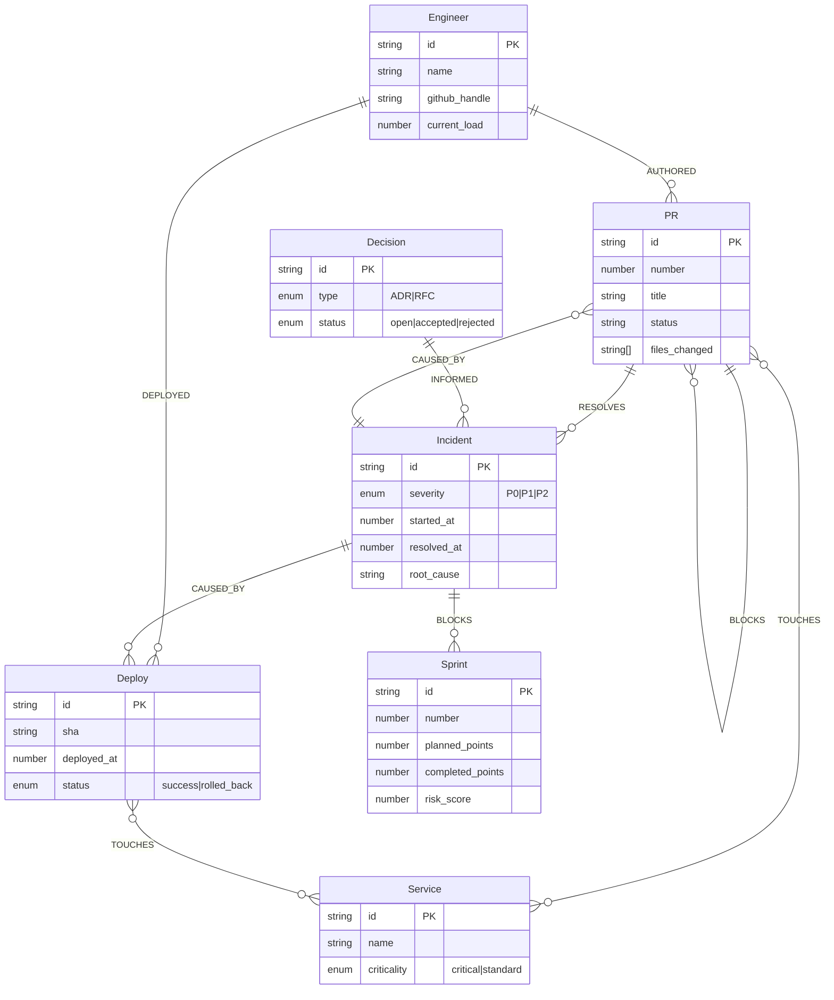

<div align="center">

# 🧠 AXON

<!-- Animated typing tagline (cycles through the three principles) -->
<a href="#-the-thesis">
  
</a>

<br />

<p>
  <em>Built for Samsung SRI-B <strong>Clash of the Claws</strong> · Round 2</em>
</p>

<!-- Status badges -->
<p>
  
  
  
  
  
  
</p>
<p>
  
  
  
  
  
</p>

<!-- Top-level navigation -->
<p>
  <a href="#-quick-start">Quick Start</a> ·
  <a href="#%EF%B8%8F-architecture">Architecture</a> ·
  <a href="#%EF%B8%8F-the-knowledge-graph-the-moat">The Moat</a> ·
  <a href="#%EF%B8%8F-the-90-second-demo">Demo</a> ·
  <a href="docs/">Docs</a> ·
  <a href="docs/decisions.md">Decisions</a>
</p>

</div>

---

## 🎯 The thesis

> A typed knowledge graph (the moat) connects engineers, services, deploys, incidents, PRs, decisions, and sprints — and every alert Axon sends pulls a sentence out of that graph that a generic LLM cannot.

The moat made literal — this is the canonical demo sentence:

<div align="center">

> ### *"3rd auth-service incident this month — pattern matches Redis connection exhaustion. ADR-014 from incident #1 is still open. Last fix: PR #847 by Aditi."*

</div>

That sentence is doing **four** things at once a stateless agent can't:

| | What it does | Why vectors fail |
|:---:|---|---|
| 🔢 | **Counts** typed entities (incidents on a service in 30 days) | Vectors paraphrase, they don't enumerate |
| 🔗 | **Joins** through typed edges (incident → ADR that informed it) | No relationship type, no join |
| 📅 | **Time-windows** ("this month") | Vector similarity has no clock |
| 🎯 | **Resolves** an engineer through `AUTHORED` to a specific PR | Embeddings can't do FK lookups |

---

## 🧭 Three principles

<table>
<tr>
<td width="33%" align="center">

### 🚀 Proactive

Pushes decisions to Telegram **before** the user asks.

Cron heartbeats.<br/>Webhook reactions.

</td>
<td width="33%" align="center">

### 🧬 Synthesized

Never a raw number without a contextual sentence.

*"11 PRs merged"* — wrong.<br/>*"11 in 24h, none on critical paths"* — right.

</td>
<td width="33%" align="center">

### 🔇 Autonomous

Silence is a feature.

Only escalates on threshold breaches.

</td>
</tr>
</table>

---

## ⏱️ The 90-second demo

```mermaid
sequenceDiagram
    autonumber
    participant U as 👤 Audience
    participant FW as 🔫 fire-webhook.ts
    participant G as ⚙️ Gateway
    participant K as 🧠 Knowledge Graph
    participant L as 🤖 Nemotron-70B
    participant T as 📱 Telegram
    participant GH as 🐙 GitHub

    Note over U,T: 0:00 — Morning brief already on Telegram (cron at 8 AM IST)
    U->>+FW: 0:10 Press any key
    FW->>+G: POST /webhook/sentry (HMAC valid)
    G->>K: resolve service · recurring · open ADRs
    K-->>G: causal context (KG query, <1ms)
    G->>+L: stream incident synthesis
    L-->>T: first chunk
    T-->>-U: 0:30 Alert lands < 60s 🟢
    deactivate G
    deactivate FW

    U->>T: 0:45 Tap [Rollback]
    T->>G: callback_data
    G->>GH: open axon-rollback issue
    GH-->>U: PR/issue URL in thread

    Note over U,T: 1:00 — pnpm exec tsx demo/add-skill.ts standup
    Note over U,T: 1:15 — open demo/kg-viz/ in browser
    Note over U,T: 1:30 — close
```

Full script and preflight checklist live in [`demo/README.md`](demo/README.md).

---

## 🏛️ Architecture

Four layers, in dependency order. The KG sits at Layer 3 and is the only stateful component — everything else is plumbing or a skill.



Each skill (brief, incident, pr, sprint) is a workspace package that wires itself into the gateway at boot. The gateway is the only file that imports all four — no skill imports another skill or the gateway. See [`docs/architecture.md`](docs/architecture.md).

---

## 🕸️ The Knowledge Graph (the moat)

**7 node types · 7 edge types · 5 named queries.** The schema is locked in [CLAUDE.md](CLAUDE.md). Resist suggestions to "simplify" — that's how you lose the moat.



### The five named queries

> Every skill goes through these. Anything else uses the inspection helpers (`getNode`, `getEdges`, `traverse`).

| Query | Powers |
|---|---|
| 🔁 `findRecurringIncidents(serviceId, days)` | The "*3rd this month*" headline |
| ⛓️ `getCausalChain(incidentId)` | "*What broke this?*" — deploys, PRs, engineers |
| 👤 `getEngineerLoad(engineerId)` | Reviewer bottlenecks · standup load · "*also leading 2 incidents this week*" |
| 📜 `getOpenADRs(serviceId?)` | "*ADR-14 still open*" call-outs |
| 💥 `getDeployImpact(deployId)` | Time-to-first-incident after a release |

Performance: **p95 < 50ms over 100 runs** asserted by `perf.test.ts` (actual numbers are sub-millisecond on the seed).

Deep dive in [`docs/knowledge-graph.md`](docs/knowledge-graph.md).

---

## 🛠️ The Five Skills

Four shipped skills + one **live** skill added on stage to prove the extensibility thesis.

<table>
<tr><th>Skill</th><th>Trigger</th><th>Model tier</th><th>Cost target</th><th>Total time</th></tr>
<tr>
  <td>🌅 <strong>Morning Brief</strong><br/><sub>packages/brief</sub></td>
  <td>cron <code>0 8 * * *</code> IST</td>
  <td>Nemotron-Mini</td>
  <td>&lt;$0.005</td>
  <td>&lt;15s</td>
</tr>
<tr>
  <td>🚨 <strong>Incident Commander</strong><br/><sub>packages/incident</sub></td>
  <td>Sentry webhook</td>
  <td>Nemotron-70B</td>
  <td>&lt;$0.05</td>
  <td><strong>&lt;60s to first chunk</strong></td>
</tr>
<tr>
  <td>🔍 <strong>PR Health · realtime</strong><br/><sub>packages/pr</sub></td>
  <td>GitHub webhook</td>
  <td><em>none</em> (templated)</td>
  <td>$0</td>
  <td>sub-second</td>
</tr>
<tr>
  <td>🔍 <strong>PR Health · digest</strong><br/><sub>packages/pr</sub></td>
  <td>cron <code>0 18 * * 1-5</code> IST</td>
  <td>Nemotron-Mini</td>
  <td>&lt;$0.005</td>
  <td>&lt;15s</td>
</tr>
<tr>
  <td>📈 <strong>Sprint Risk Radar</strong><br/><sub>packages/sprint</sub></td>
  <td>cron <code>0 9 * * 1-5</code> IST</td>
  <td>Nemotron-Mini</td>
  <td>&lt;$0.005</td>
  <td>&lt;15s</td>
</tr>
<tr>
  <td>⚡ <strong>Standup</strong> (the flex)<br/><sub>demo/add-skill.ts</sub></td>
  <td>CLI / live demo</td>
  <td><em>none</em> (templated)</td>
  <td>$0</td>
  <td>&lt;5s</td>
</tr>
</table>

Each skill follows the same shape (`types.ts → handler.ts → synthesize.ts → register.ts → cli/run-now.ts → index.ts`) so adding a sixth is glue, not framework. See [`docs/skills.md`](docs/skills.md) and [`docs/extending.md`](docs/extending.md).

---

## 🚨 The Incident Commander pipeline

The showstopper. **<60s SLA** verified end-to-end with fake-timer e2e tests.

```mermaid
stateDiagram-v2
    direction LR
    [*] --> Webhook: Sentry POST /webhook/sentry
    Webhook --> Validated: HMAC ✓
    Webhook --> Rejected: HMAC ✗ (401)
    Validated --> Queued: enqueue 'incident'<br/>respond 200 in <2s

    state "T0 → T1 · Ingest" as Ingest {
        Queued --> Parsed: parseAndValidateSentry
        Parsed --> Persisted: sentryToIncident<br/>idempotent on event_id
    }

    state "T1 → T2 · Enrich" as Enrich {
        Persisted --> EnrichRunning: Promise.all
        EnrichRunning --> EnrichDone: KG queries + Octokit commits
    }

    state "T2 → T3 · Synthesize" as Synth {
        EnrichDone --> Streaming: Nemotron-70B<br/>stream:true
        Streaming --> FirstChunk: first delta arrives
        FirstChunk --> Sent: telegram.send 🟢
    }

    Sent --> [*]: handler resolves at T3<br/>(within 60s SLA)
    Sent --> Background: continue stream (async)
    Background --> Throttled: editMessage every 800ms
    Throttled --> Final: final edit + buttons<br/>[[Rollback], [Ack, Escalate]]
    Final --> RecoveryStart: recovery.start (no await)

    state "Recovery monitor" as Recovery {
        RecoveryStart --> Polling: every 30s
        Polling --> Polling: error count ≥ threshold<br/>(reset counter)
        Polling --> Confirmed: 2× consecutive < threshold
        Polling --> Timeout: 10 min elapsed
    }

    Confirmed --> [*]: kg.updatePayload(resolved_at)
    Timeout --> [*]: send timeout msg
```



Stage timings logged structurally on every run:

```json
{
  "component": "incident", "traceId": "t-...",
  "stage_ingest_ms": 2, "stage_enrich_ms": 327,
  "stage_synth_first_chunk_ms": 603,
  "total_ms": 932, "sla_60s": true
}
```

`demo/fire-webhook.ts` tails this exact line through `LOG_FILE` and prints the SLA result on stage.

---

## 🗓️ Build phases

Eight phases, each gated by a verification step. All complete.

```mermaid
gantt
    title         Axon — 8-Phase Build Plan
    dateFormat    X
    axisFormat    %s
    section Foundation
    Phase 0 · Scaffold (monorepo, env, tsconfig)        :done, p0, 0, 5
    Phase 1 · Knowledge Graph (the moat)                 :done, crit, p1, after p0, 25
    section Surface
    Phase 2 · Gateway (webhooks, queue, scheduler)       :done, p2, after p1, 10
    Phase 3 · Morning Brief                              :done, p3, after p2, 15
    section Showstopper
    Phase 4 · Incident Commander                         :done, crit, p4, after p3, 30
    section Polish
    Phase 5 · PR Health                                  :done, p5, after p4, 8
    Phase 6 · Sprint Risk Radar (cuttable, kept)         :done, p6, after p5, 5
    Phase 7 · Demo Polish (kg-viz, fire-webhook, ...)    :done, p7, after p6, 5
```



Critical-path phases (Phase 1 KG and Phase 4 Incident) carry the demo. The phase-by-phase prompts that produced this code are in [`prompts.md`](prompts.md).

---

## 🚀 Quick Start

<details>
<summary><b>Prereqs</b></summary>

- Node 20+ (`node -v`)
- pnpm 8+ (`pnpm -v`)
- Build tools for `better-sqlite3`'s native binding:
  - macOS: `xcode-select --install`
  - Linux (Debian/Ubuntu): `sudo apt install build-essential python3`
  - Windows: Visual Studio Build Tools (or `npm install --global windows-build-tools`)

</details>

```bash
# 1. Install
pnpm install

# 2. Configure
cp .env.example .env
$EDITOR .env   # fill in tokens — see docs/operations.md

# 3. Seed the knowledge graph (52 nodes / 65 edges → ./data/axon.db)
pnpm seed

# 4. Run the gateway
pnpm dev
# → "gateway listening on port 3000"
# → cron registered: morning-brief, pr-digest, sprint-risk
```

<details>
<summary><b>Verify the install end-to-end</b></summary>

```bash
pnpm typecheck       # all 7 packages clean
pnpm test            # 127 tests across 7 packages, ~3s wallclock
```

</details>

<details>
<summary><b>Manual triggers (handy during demo prep)</b></summary>

```bash
pnpm exec tsx packages/brief/src/cli/run-now.ts        # 🌅 morning brief
pnpm exec tsx packages/sprint/src/cli/run-now.ts       # 📈 sprint risk
pnpm exec tsx packages/pr/src/cli/run-now.ts           # 🔍 PR digest
pnpm exec tsx demo/fire-webhook.ts                     # 🚨 synthetic incident
pnpm exec tsx demo/add-skill.ts standup                # ⚡ extensibility flex
```

</details>

---

## ⚙️ Tech stack

> Every choice is locked in [`CLAUDE.md § Tech Stack`](CLAUDE.md). Don't swap providers without updating CLAUDE.md in the same change.

<table>
<tr><th>Concern</th><th>Choice</th><th>Why</th></tr>
<tr><td>Runtime</td><td>Node 20+, ESM only</td><td>Top-level await, fetch built-in, modern stdlib</td></tr>
<tr><td>Language</td><td>TypeScript 5+, <code>strict</code> + <code>noUncheckedIndexedAccess</code> + <code>exactOptionalPropertyTypes</code></td><td>The KG type-safety is the moat's runtime contract</td></tr>
<tr><td>Monorepo</td><td>pnpm workspaces (7 packages)</td><td>Symlinked workspace deps, no lerna ceremony</td></tr>
<tr><td>Storage</td><td><code>better-sqlite3</code> (sync, WAL)</td><td>Single-process daemon → no async overhead, no driver pool</td></tr>
<tr><td>Validation</td><td>Zod at every I/O boundary</td><td>Schema is checked on read AND write</td></tr>
<tr><td>HTTP</td><td>Express</td><td>Thin, debuggable</td></tr>
<tr><td>Cron</td><td><code>node-cron</code> · <code>Asia/Kolkata</code> pinned</td><td>Product timezone is fixed regardless of host clock</td></tr>
<tr><td>LLM SDK</td><td><code>openai</code> (OpenAI-compatible)</td><td>Pointed at Together.ai or OpenRouter via <code>LLM_BASE_URL</code></td></tr>
<tr><td>LLM models</td><td>Nemotron-70B · Nemotron-Mini</td><td>Two-tier routing — large for incidents, small for routine</td></tr>
<tr><td>Telegram</td><td><code>node-telegram-bot-api</code> + raw <code>fetch</code></td><td>Polling for callbacks, fetch for send/edit (retry + escape)</td></tr>
<tr><td>Logging</td><td><code>pino</code> JSON, optional file tee</td><td>Single-line structured; <code>LOG_FILE</code> drives demo SLA tooling</td></tr>
<tr><td>Tests</td><td>Vitest</td><td>Fast, ESM-native, full <code>vi.mock</code> support</td></tr>
</table>

Cost story:

```
🚨 Incident Commander  →  < $0.05  per incident   (Nemotron-70B, ~800 tokens)
🌅 Morning Brief       →  < $0.005 per run        (Nemotron-Mini, ~600 tokens)
🔍 PR Digest           →  < $0.005 per run        (Nemotron-Mini, ~700 tokens)
📈 Sprint Risk         →  < $0.005 per run        (Nemotron-Mini, ~400 tokens)
🔍 PR Health realtime  →  $0                      (no LLM — templated)
⚡ Standup (live skill) →  $0                     (no LLM — templated)
```

---

## 📊 Project status

<div align="center">

| | | | |
|:---:|:---:|:---:|:---:|
| **8 / 8** | **7** | **127 / 127** | **0** |
| phases shipped | workspace packages | tests passing | tests failing |
| | | | |
| **52** | **65** | **5** | **< 50ms** |
| KG nodes (seed) | KG edges (seed) | named queries | p95 query latency |
| | | | |
| **< 60s** | **< $0.05** | **< 2s** | **~3s** |
| incident SLA | per incident | webhook ack | full test suite |

</div>

Every number above is enforced by a test or a structural log line. See [`docs/operations.md § Verifying a clean boot`](docs/operations.md#verifying-a-clean-boot).

---

## 🌳 Repo layout

```
axon-cto/
├── 📜 CLAUDE.md                  Source of truth — schema, conventions, locked choices
├── 📖 README.md                  You are here
├── 📁 docs/                      Architecture / KG / skills / ops / extending / decisions
├── 🎬 demo/                      90-second demo kit
│   ├── README.md
│   ├── fire-webhook.ts          🔫 staged auth-service incident, keypress to fire
│   ├── stopwatch.html           ⏱  presenter stopwatch (<60s SLA on screen)
│   ├── kg-viz/index.html        🕸 D3 force-directed graph of the live KG
│   └── add-skill.ts             ⚡ live extensibility flex
├── 📦 packages/
│   ├── shared/                  Telegram client, logger, env, trace propagation
│   ├── kg/                      🧠 Knowledge graph — THE MOAT
│   ├── gateway/                 ⚙️  Express server, webhooks, queue, scheduler, boot
│   ├── brief/                   🌅 Morning intelligence brief (cron, Nemotron-Mini)
│   ├── incident/                🚨 Incident commander (webhook, Nemotron-70B)
│   ├── pr/                      🔍 PR & code-health monitor (webhook + cron)
│   └── sprint/                  📈 Sprint risk radar (cron, Nemotron-Mini)
└── 💾 data/
    ├── axon.db                  SQLite — the graph store
    └── gateway.log              when LOG_FILE is set; tailed by fire-webhook.ts
```

---

## 🚫 What Axon is NOT

<table>
<tr>
<td width="25%" align="center">

### 🤖❌

**Not a chatbot**

No free-form prompt → response. Inputs are commands and button callbacks only.

</td>
<td width="25%" align="center">

### 📊❌

**Not a dashboard**

No web UI for end users. Output is Telegram and the KG visualization.

</td>
<td width="25%" align="center">

### 👥❌

**Not multi-tenant**

Single deployment, single CTO user, one Telegram chat.

</td>
<td width="25%" align="center">

### 📡❌

**Not real-time analytics**

We poll, schedule, and react to webhooks. No streaming pipeline.

</td>
</tr>
</table>

Each "not" is deliberate. Every "no" sharpens the thesis.

---

## 📚 Documentation

| Topic | File |
|---|---|
| 🏛️ Four-layer architecture, request flow, package boundaries | [`docs/architecture.md`](docs/architecture.md) |
| 🧠 The knowledge graph: schema, queries, why it's typed | [`docs/knowledge-graph.md`](docs/knowledge-graph.md) |
| 🛠️ What each skill does, when it fires, the file shape they share | [`docs/skills.md`](docs/skills.md) |
| ⚙️ Env vars, scripts, dev loop, observability, shutdown, troubleshooting | [`docs/operations.md`](docs/operations.md) |
| ➕ Adding a fifth skill — the patterns the existing four follow | [`docs/extending.md`](docs/extending.md) |
| 🤔 Notable design decisions — the "why" log | [`docs/decisions.md`](docs/decisions.md) |
| 📜 Project memory — schema, conventions, locked choices | [`CLAUDE.md`](CLAUDE.md) |
| 🎬 The 90-second demo arc + preflight + recording instructions | [`demo/README.md`](demo/README.md) |
| 🧪 The 8 phase prompts that produced this code (reproducibility) | [`prompts.md`](prompts.md) |

---

## 🎬 Demo video

The fallback safety net for live failure. Recorded as `demo/axon-demo.mp4`. Two takes, keep the better one. Recording instructions in [`demo/README.md § Recording`](demo/README.md#recording-the-demo-video).

---

<!-- ───────────── credits ───────────── -->

<div align="center">

<br/>


<br/><br/>

## 👥 Built by

<table>
<tr>
  <td align="center" width="25%">
    <br/>
    <h3>Ryan Gomez</h3>
    <sub>🧠 architecture · 🕸 knowledge graph</sub>
  </td>
  <td align="center" width="25%">
    <br/>
    <h3>Aditya Gangwani</h3>
    <sub>⚙️ gateway · 🚨 incident commander</sub>
  </td>
  <td align="center" width="25%">
    <br/>
    <h3>Shivesh Tiwari</h3>
    <sub>🌅 morning brief · 📈 sprint risk</sub>
  </td>
  <td align="center" width="25%">
    <br/>
    <h3>Siddarth Priyatam</h3>
    <sub>🔍 PR health · 🎬 demo polish</sub>
  </td>
</tr>
</table>

<br/>

<p>
  <em>Samsung SRI-B · <strong>Clash of the Claws</strong> · Round 2</em>
</p>

<br/>


&nbsp;


<br/><br/>

<sub>📜 Licensed under MIT · See <a href="LICENSE">LICENSE</a> if present, otherwise treat the contents of this repo as MIT-licensed for the purpose of this submission.</sub>

</div>
